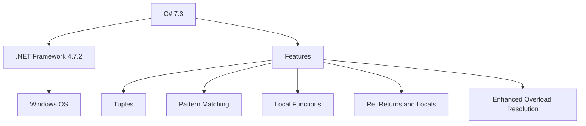

```mermaid
graph TD
	A[C# 7.3] --> B[.NET Framework 4.7.2]
	B --> C[Windows OS]
	A --> D[Features]
	D --> E[Tuples]
	D --> F[Pattern Matching]
	D --> G[Local Functions]
	D --> H[Ref Returns and Locals]
	D --> I[Enhanced Overload Resolution]
```	